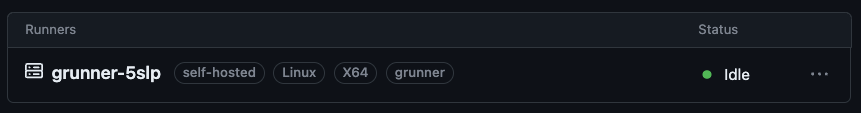

# grunner

Private runner for GitHub Actions on GCP



> If you use this template repo it's recommended that you only use self-hosted runners with a private repo, otherwise potentially dangerous code can be submitted as PR which your runner then would execute. Yes, the runners for this template repo have been disabled 😁

## setup 

Create Terraform variables file: `deployments/terraform.tfvars`:

```shell
name    = "grunner"
project = "your-project-id"
region  = "us-west1"
zone    = "c"
machine = "e2-medium"
vms     = 3
image   = "ubuntu-2204-jammy-v20230616"
size    = 10
repo    = "your-github-username/grunner"
token    = "<github-pat>"
```

> Update as necessary, the GitHub PAT is only needed for obtain registration token for each VM. See [scripts/startup](scripts/startup) for usage.

Create GCS bucket to store Terraform state. Couple of things to keep in mind: 

* Bucket name has to be globally unique (the one in example below is mind)
* The `project` flag value should match the values from `deployments/terraform.tfvars` 
* Bucket name must match the name in `deployments/backend.tf`. 

```shell
gcloud storage buckets create \
    gs://grunner-terraform-state \
    --project s3cme1 \
    --location us-west1
```

When done, navigate into the [./deployments](./deployments) directory and initialize Terraform:

```shell
cd deployments
terraform init
```

## deploy

Assuming the above `setup` has been configured, you can now deploy the private GitHub Runner:

```shell
terraform apply
```

Check that at least one runner is registered by navigating to: https://github.com/<owner>/<repo>/settings/actions/runners 

## usage

Your GitHub Actions workflows are same as with the managed runner. The only update is the `runs-on` value, which is not set to `self-hosted`

```yaml
jobs:
  demo:
    name: Test runner
    permissions:
      contents: read
    runs-on: self-hosted
    ...
```

## debug

If VM starts but you do not see the runners registered in GitHub Settings (https://github.com/<owner>/<repo>/settings/actions/runners)

Start by listing the instances: 

```shell
gcloud compute instances list --filter "tags.items=grunner" --project $PROJECT_ID
```

The response should look something like this: 

```shell
NAME          ZONE        MACHINE_TYPE  INTERNAL_IP  EXTERNAL_IP  STATUS
grunner-5hdz  us-west1-b  e2-medium     10.138.0.55  *.*.*.*      RUNNING
grunner-98c6  us-west1-c  e2-medium     10.138.0.50  *.*.*.*      RUNNING
...
```

Pick one of the VMs and connect to it using SSH: 

```shell
gcloud compute ssh grunner-5hdz \
  --tunnel-through-iap \
  --zone us-west1-b \
  --project $PROJECT_ID
```

Check the output of the startup script:

```shell
sudo journalctl -u google-startup-scripts.service
```

The last few lines should confirm that the runner service has started: 

```shell
...
google_metadata_script_runner[1450]: Finished running startup scripts.
systemd[1]: google-startup-scripts.service: Deactivated successfully.
systemd[1]: Finished Google Compute Engine Startup Scripts.
```

If not, you can re-run the script, to find the issue: 

```shell
sudo google_metadata_script_runner startup
```

## cleanup

To destroy all resources created by this demo:

> Note, make sure to enter `yes` when prompted.

```shell
terraform destroy
```

## Disclaimer

This is my personal project and it does not represent my employer. While I do my best to ensure that everything works, I take no responsibility for issues caused by this code.
