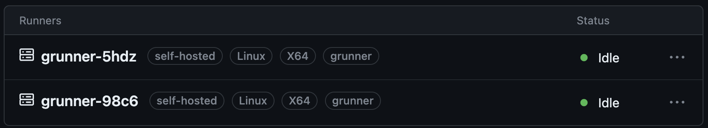

# grunner

Self-hosted GitHub Actions runner on GCP using GCE.


* GCE VMs in Managed Instance Groups (MIGs)
* Customizable runner:
  * VMs (image type, CPU, memory)
  * MIG (size of runner group)
* Configurable tooling (startup/shutdown script)
* User-defined IAM service account
* Unique GitHub token for each runner

> Use private repo when using this template. Forks of a public repository could potentially run dangerous code on your self-hosted runner machine by creating a pull request that executes the code in a workflow. More on self-hosted runner security [here](https://docs.github.com/en/actions/hosting-your-own-runners/managing-self-hosted-runners/about-self-hosted-runners#self-hosted-runner-security).

## prerequisites

Since you are interested in self-hosted runners on GCP, you probably already have GCP account and a project. If not, [see](https://cloud.google.com/resource-manager/docs/creating-managing-projects). 

You will also need `gcloud`. You can find instructions on how to install it [here](https://cloud.google.com/sdk/docs/install). Mak sure to authenticate:
  
```shell
gcloud auth application-default login
```

## setup 

Start by initializing the repo: 

> This will update all repo specific names from the template to your new repo name. 

```shell
scripts/init-repo
```

Next, create Terraform variables file: `deployments/terraform.tfvars`:

> Update as necessary. The number of VMs, the image type, and its size will depend on your use-case. The GitHub Personal Access Tokens (PAT) is only needed for obtain registration token for each VM. You can find more about PATs [here](https://docs.github.com/en/authentication/keeping-your-account-and-data-secure/managing-your-personal-access-tokens).

```shell
name    = "grunner"
project = "<your-project-id>"
region  = "us-west1"
repo    = "mchmarny/grunner"
token   = "<github-pat>"
```

> For complete list of the variables you can define see [deployments/variables.tf](deployments/variables.tf).

Create GCS bucket to store Terraform state. Couple of things to keep in mind: 

* Bucket name has to be globally unique
* The `project` flag value should match the values from `deployments/terraform.tfvars` 
* Bucket name must match the name in `deployments/backend.tf`. 

```shell
gcloud storage buckets create \
    gs://grunner-terraform-state \
    --project $PROJECT_ID \
    --location us-west1
```

When done, navigate into the [./deployments](./deployments) directory and initialize Terraform:

```shell
cd deployments
terraform init
```

## deploy

Assuming the above `setup` has been configured, you can now deploy the private GitHub Runner:

```shell
terraform apply
```

Check that at least one runner is registered by navigating to: https://github.com/$OWNER/$REPO/settings/actions/runners 



## usage

Your GitHub Actions workflows are same as with the managed runner. The only update is the `runs-on` value, which is not set to `self-hosted`

```yaml
jobs:
  demo:
    name: Test runner
    permissions:
      contents: read
    runs-on: self-hosted
    ...
```

## debug

If VM starts but you do not see the runners registered in GitHub Settings.

Start by listing the instances: 

```shell
gcloud compute instances list --filter "tags.items=grunner" --project $PROJECT_ID
```

The response should look something like this: 

```shell
NAME          ZONE        MACHINE_TYPE  INTERNAL_IP  EXTERNAL_IP  STATUS
grunner-5hdz  us-west1-b  e2-medium     10.138.0.55  *.*.*.*      RUNNING
grunner-98c6  us-west1-c  e2-medium     10.138.0.50  *.*.*.*      RUNNING
...
```

Pick one of the VMs and connect to it using SSH: 

```shell
gcloud compute ssh grunner-5hdz \
  --tunnel-through-iap \
  --zone us-west1-b \
  --project $PROJECT_ID
```

Check the output of the startup script:

```shell
sudo journalctl -u google-startup-scripts.service
```

The last few lines should confirm that the runner service has started: 

```shell
...
google_metadata_script_runner[1450]: Finished running startup scripts.
systemd[1]: google-startup-scripts.service: Deactivated successfully.
systemd[1]: Finished Google Compute Engine Startup Scripts.
```

If not, you can re-run the script, to find the issue: 

```shell
sudo google_metadata_script_runner startup
```

## cleanup

To destroy all resources created by this demo:

> Note, make sure to enter `yes` when prompted.

```shell
terraform destroy
```

## disclaimer

This is my personal project and it does not represent my employer. While I do my best to ensure that everything works, I take no responsibility for issues caused by this code.
